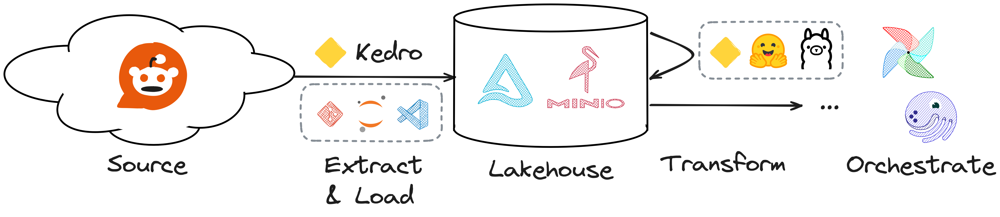

# Who needs ChatGPT? Rock solid AI pipelines with Hugging Face and Kedro


Material for the workshop "Who needs ChatGPT? Rock solid AI pipelines with Hugging Face and Kedro".

[](https://gitpod.io/#https://github.com/astrojuanlu/workshop-kedro-huggingface/)



## Outline

### Kedro as a library: catalog and configuration

```python
from kedro.config import OmegaConfigLoader
from kedro.io import DataCatalog

config_loader = OmegaConfigLoader(".")  # Configuration lives in current directory
print(config_loader["catalog"])  # Catalog configuration gets returned as a dictionary
catalog = DataCatalog.from_config(config_loader["catalog"])

catalog.load("ds_name")  # Loads the dataset corresponding to the `ds_name` entry in `catalog.yml`
```

### Kedro pipelines using Kedro as a framework

```bash
$ uv pip install pdm && pdm init
Creating a pyproject.toml for PDM...
...
Project name (workshop-kedro-huggingface): reddit-summarizer   
Project version (0.1.0): 
Do you want to build this project for distribution(such as wheel)?
If yes, it will be installed by default when running `pdm install`. [y/n] (n): y
...
Changes are written to pyproject.toml.
$ kedro-init .
[15:29:22] Looking for existing package directories      cli.py:25
[15:29:31] Initialising config directories               cli.py:25
           Creating modules                              cli.py:25
           🔶 Kedro project successfully initialised!     cli.py:26
$ kedro registry list
- __default__
$ kedro pipeline create data_processing
$ # ...
$ kedro run
```

### Visualising the structure of the pipeline

```
$ kedro viz run
```

### Deploying Kedro to Airflow

```
$ kedro airflow create
```

## Links

- Kedro documentation https://docs.kedro.org/en/0.19.3/
